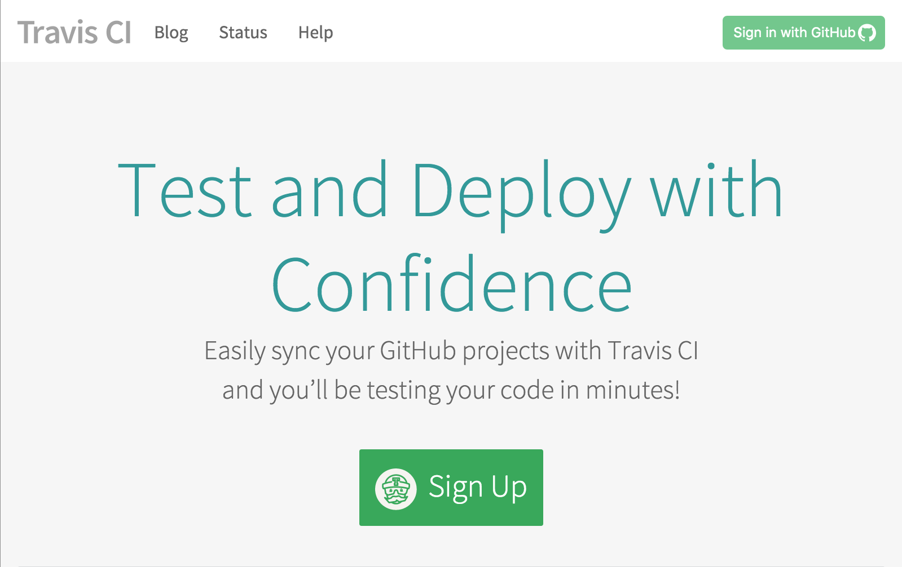
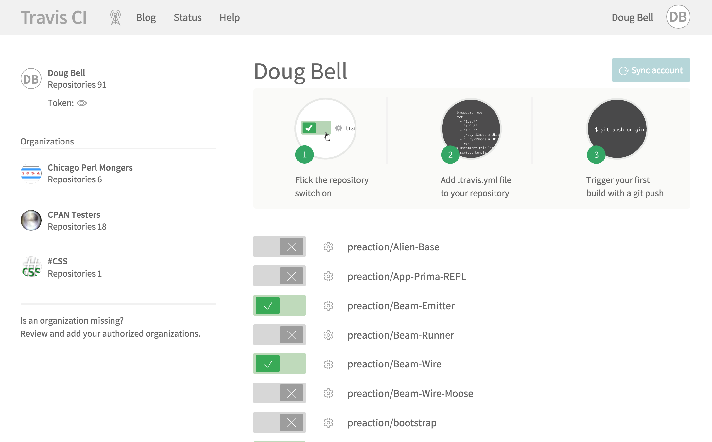

# Getting the Most Out of Travis

<http://preaction.github.io/Getting-The-Most-From-Travis-CI-For-Perl/>

How to get the most out of Travis CI for your Perl project.

<div style="width: 50%; float: left">

[Source on <i class="fa fa-github"></i>](https://github.com/preaction/Getting-The-Most-From-Travis-CI-For-Perl)<br/>

[CC-BY-SA 4.0](https://creativecommons.org/licenses/by-sa/4.0/legalcode)<br/>

</div>

<div class="width: 50%; float: left">

by [Doug Bell (preaction)](http://preaction.me)<br>
<a href="http://twitter.com/preaction"><i class="fa fa-twitter"></i> @preaction</a><br/>
<a href="http://github.com/preaction"><i class="fa fa-github"></i> preaction</a><br>
[Chicago.PM](http://chicago.pm.org)<br>

</div>

------

# Getting the Most Out of Travis


------

# [Travis-CI](http://travis-ci.org)

---

# Continuous Integration

---

# Automated Testing

---

# Test Every Change

---


# For Github

---

# Free!

------

# Config file
## `.travis.yml`

---

```
language: perl
perl:
    - "5.16"
    - "5.18"
    - "5.20"
sudo: false
before_install:
    - eval $(curl https://travis-perl.github.io/init) --auto
```

------

# `language: perl`

[Travis supports many
languages](https://docs.travis-ci.com/user/getting-started)

------

# `perl:`

## Array of versions

---

# `- 5.20`

## Latest 5.20 prebuilt

---

# Travis-built

[Details of Perl VM
images](https://docs.travis-ci.com/user/ci-environment/#Perl-VM-images)

---

# Contains non-core modules!

For performance

---

# Build Time Limit!

50 minutes

---

# `- 5.20.1`
## Clean, pre-built

---

# No non-core modules
## Slower build

---

# `- 5.20.1-thr`
## Perl with threading

---

# `- dev`
## Latest dev perl (5.23.x)

---

# `- blead`
## Build Perl from git

------

# `sudo: false`
## Disable sudo for speed

---

# [Travis Containers](https://docs.travis-ci.com/user/workers/container-based-infrastructure/)

---

# Ubuntu 12.04 LTS Server Edition 64 bit

[Virtualization
details](https://docs.travis-ci.com/user/ci-environment/#Virtualization-environments)

---

# No sudo, easy cleanup

---

# Use sudo
# Install prereqs

`apt-get`

------

# `before_install:`

---

`eval $(curl https://travis-perl.github.io/init) --auto`

---

# [Travis Perl Helpers](https://github.com/travis-perl/helpers)

---

# Automatically build

---

# Run tests

---

# Any CPAN-style dist

---

# Makefile.PL

ExtUtils::MakeMaker

---

# Build.PL

Module::Build et. al.

---

# dist.ini

Dist::Zilla

------

# Enable Travis

---



# Sign in with Github

---



# Add a Repository

---

# Flick the switch

------

# And you're done!

------

# Build Phases

---

```
before_install:
  - eval $(curl https://travis-perl.github.io/init) --auto
```

Short version

---

# Long version

---

```
before_install:
  - git clone git://github.com/travis-perl/helpers ~/travis-perl-helpers
  - source ~/travis-perl-helpers/init
  - build-perl
  - perl -V
  - build-dist
  - cd $BUILD_DIR
```

Set up build environment

---

```
install:
  - cpan-install --deps
  - cpan-install --coverage
```

Install prereqs

---

```
before_script:
  - coverage-setup
script:
  - prove -l -j$(test-jobs) $(test-files)
after_success:
  - coverage-report
```

Run the build

---

# Customize Build

------

# Build Matrix

---

# Finer Control

---

# Special environment

------

# Coverage Reports

---

```
matrix:
    include:
        - perl: 5.18
          env: COVERAGE=1
```

---

# Sends to [coveralls.io](http://coveralls.io)

Also free!

------

# Optional Prereqs

---

# Devel::Hide

---

# Hide modules from require

---

```
before_install:
    # ...
    - cpan-install Devel::Hide
```

Install Devel::Hide

---

```
script:
    # ...
    - export PERL5OPT="-MDevel::Hide"
    - export DEVEL_HIDE_VERBOSE=0
```

Load Devel::Hide for every build

---

```
matrix:
    include:
        - perl: "5.20"
          env: DEVEL_HIDE_PM="My::Hidden"
```

Hide modules in the matrix

------

# More Ideas

---

# Build custom Perl

Travis comes with Perlbrew

------

# Questions?

---

More info:

* [Travis-CI: Getting
  Started](https://docs.travis-ci.com/user/getting-started/)
* [Travis-CI: Customizing the
  Build](https://docs.travis-ci.com/user/customizing-the-build/)
* [Travis-CI: Building a Perl
  Project](https://docs.travis-ci.com/user/languages/perl)

---

This talk:

* [On Github](http://preaction.github.io/Getting-The-Most-From-Travis-CI-For-Perl)
* [Source](http://github.com/preaction/Getting-The-Most-From-Travis-CI-For-Perl)
* License: CC-BY-SA

